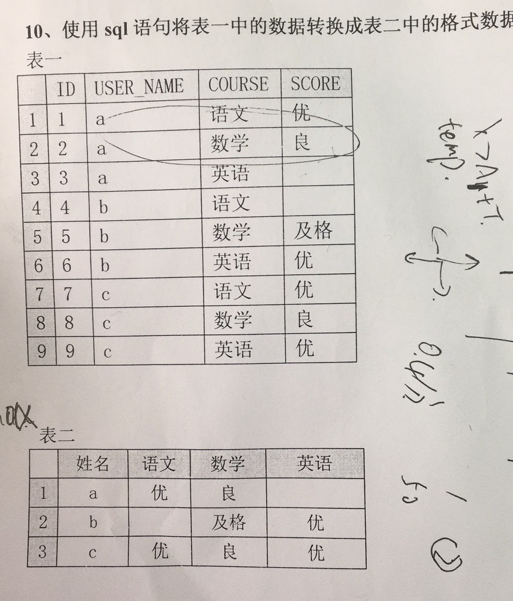

# 数据库_行转列
##### 题目：  


```sql
-- 简化后
SELECT user_name,
max(CASE  WHEN course='chinese' THEN score ELSE null END) chinese,
max(CASE WHEN course ='math' THEN score ELSE null END) math,
max(CASE  WHEN course ='english' THEN score ELSE null END) english
FROM students
group by user_name
  
---简化前
select user_name,
max(chinese) as chinese,
max(math) as math,
max(english) as english
from (SELECT user_name,
CASE  WHEN course='chinese' THEN score ELSE null END chinese,
CASE WHEN course ='math' THEN score ELSE null END math,
CASE  WHEN course ='english' THEN score ELSE null END english
FROM students) as a
group by user_name
```