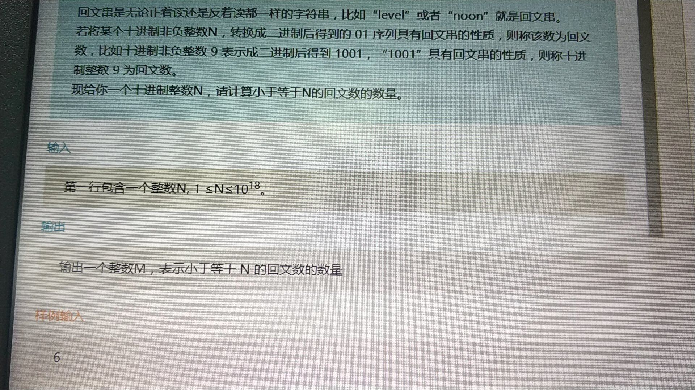

# 子回文数
#### 题目：
  
##### 未验证的方法：
```java

import java.util.Scanner;

/**
 * 此类包含了两个方法，第一个方法是位数确定算子回文数，第二个方法是按位数依次算回文数，两个方法要协同工作
 */
public class Main {
    public static void main(String[] args) {
        Scanner sc = new Scanner(System.in);
        Long n = sc.nextLong();
        String s = Long.toBinaryString(n);
        int m2 = solution2(s.substring(1));
        int m1 = solution(s,true);
        int m =0;
        if (!s.substring(1).contains("1")){
            m = m2;
        }else{
            m = m1+m2;
        }
        System.out.print(m);

    }

    /**
     *
     * @param sn
     * @param flag 高位是否不能变
     * @return
     */
    public static int solution(String sn,Boolean flag) {
        int m = 0;
        int temp = sn.length();
        int x = 0;
        if (sn.equals("11")&&flag){
            return 1;
        }
        if (sn.equals("00") || sn.equals("10") || sn.equals("01")||sn.equals("0")) {
            return 1;
        }
        if (sn.equals("11")||sn.equals("1")) {
            return 2;
        }
        if (sn.charAt(0) == '0') {
            m += solution(sn.substring(1, sn.length() - 1),false);
        } else {
            if (!sn.substring(1).contains("1")) {
                int temp1 = 1;
                for (int i = 0; i < sn.length() / 2; i++) {
                    temp1 = temp1 * 2;
                }
                m += temp1;
            } else {
                if (!flag){
                    m += solution(sn.substring(1, sn.length() - 1),false);
                }
                if (sn.charAt(sn.length() - 1) == '0') {
                    sn = Long.toBinaryString(Long.parseLong(sn, 2) - 1);
                }
                m += solution(sn.substring(1, sn.length() - 1),false);

            }
        }

        return m;
    }

    public static int solution2(String sn) {
        int m =0;
        int t = sn.length();
        String str ="";
        for (int i = 1; i < t+1; i++) {
            str="";
            for (int j = 1; j < i+1; j++) {
                str = str+'1';
            }
            m+=solution(str,true);
        }
        return m;
    }
}

```